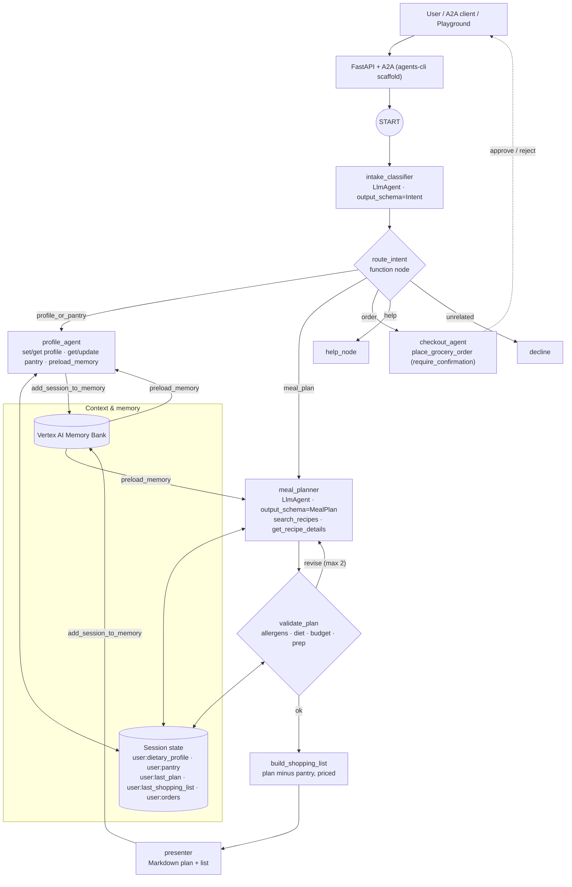

# PantryPal: meal-plan and grocery concierge agent

> **Track:** Concierge Agents · **Stack:** Google ADK 2.x (Python, graph `Workflow`) · `agents-cli` 1.8 · Gemini on Agent Platform · Agent Runtime · Terraform · GitHub Actions

## Problem

Planning a household's meals each week is repetitive and easy to get wrong. People forget a
family member's allergy or dislikes, buy things already in the pantry, go over budget, and
start again from scratch every week because nothing is remembered.

## Solution

**PantryPal** is a conversational agent that:

1. **Remembers the household** (diet, allergies, dislikes, servings, weekly budget) and
   **the pantry** *across sessions*.
2. **Plans meals** from a curated recipe catalog. Allergens, diet and budget are enforced
   by **deterministic code**, not only by the LLM.
3. **Builds a shopping list** scaled to the household, minus pantry stock, grouped by
   aisle and priced.
4. **Places a (mock) grocery order** only after the user **explicitly approves** it
   (human-in-the-loop).
5. Politely **declines** off-topic requests and prompt-injection attempts.

```text
You:       We're vegetarian, allergic to peanuts, cooking for 2, $80 a week.
PantryPal: Saved: Vegetarian · Peanuts · 2 servings · $80/week. Want me to plan meals?
You:       I have rice, eggs, spinach and canned tomatoes.
You:       Plan 3 dinners, nothing over 30 minutes.
PantryPal: | 1 | Veggie Fried Rice with Egg | 20 | … shopping list by aisle …
           Already in your pantry: canned tomatoes, eggs, rice, spinach (saves $7.80)
           Estimated total $7.90 (limit $34.29). Say "order it" when you're ready.
You:       Order it for Saturday morning.
PantryPal: [asks for approval] → Order PP-E5496AC2 placed: 10 items, $7.90.
--- new session, days later ---
You:       Plan next week.          ← profile and pantry are still remembered
```

---

## Architecture



| Layer | Implementation |
|---|---|
| Orchestration | [`app/agent.py`](app/agent.py): ADK graph `Workflow` with conditional routing and a validate→revise loop |
| Deterministic logic | [`app/catalog.py`](app/catalog.py) (pure Python) and [`app/nodes.py`](app/nodes.py) (function nodes) |
| Tools | [`app/tools.py`](app/tools.py) |
| Contracts | [`app/schemas.py`](app/schemas.py) (Pydantic) |
| Guardrails & memory hooks | [`app/callbacks.py`](app/callbacks.py) |
| Observability plugin | [`app/plugins.py`](app/plugins.py) |
| Serving | [`app/fast_api_app.py`](app/fast_api_app.py): ADK API, A2A, Agent Runtime adapter (scaffolded) |
| Services | [`app/app_utils/services.py`](app/app_utils/services.py): sessions, artifacts, Memory Bank |
| Data | [`app/data/recipes.json`](app/data/recipes.json): 30 recipes, the only source of prices, allergens and nutrition |

---

## How it meets the assessment criteria

### 1. Tool & interface design
- **Six single-purpose tools** with verb_noun names, type hints and docstrings that say *when*
  to call them ([`app/tools.py`](app/tools.py)).
- Every tool returns `{"status": "success" | "error", ...}` with an actionable `error_message`
  (e.g. *"No recipes match… relax cuisine/prep/cost but never allergies"*), so the model can
  recover instead of crashing.
- **Compact outputs**: `search_recipes` returns summaries, and the full ingredient list is
  only fetched on demand with `get_recipe_details`.
- **Safe defaults in code**: `search_recipes` *always* applies the stored allergies, dislikes and
  diet, and a request can only make the diet stricter, never looser.
- **Human-in-the-loop**: `place_grocery_order` is wrapped in
  `FunctionTool(..., require_confirmation=True)`. Items and total come from saved state, never
  from model arguments. The receipt is saved as an **artifact** (`order-<id>.json`).
- **Interfaces**: ADK REST/SSE, **A2A** (agent card + JSON-RPC), and the Agent Runtime
  `reasoning_engine` adapter, all from the scaffold.

### 2. Context & memory
- **Session state with scopes**: `user:`-prefixed keys (profile, pantry, last plan, list, orders)
  persist across a user's sessions. Per-request keys (`plan_request`, `plan_feedback`,
  `plan_revisions`) drive the planning loop.
- **Context engineering**: every LLM node runs `single_turn` and gets **only what it needs**,
  injected into its instruction via `{user:dietary_profile?}`, `{user:pantry?}`,
  `{user:last_plan?}` and `{plan_feedback?}` templates, rather than the whole transcript.
- **Long-term memory**: `VertexAiMemoryBankService` on Agent Runtime (in-memory locally).
  `add_session_to_memory` runs after profile/plan turns, and `preload_memory` recalls soft
  preferences ("loves Thai food") in later sessions. Structured facts that code must enforce
  (allergies) live in state. Fuzzy preferences live in Memory Bank.
- **Safety net**: allergies or a diet mentioned in *any* message are merged into the profile by
  `route_intent` in code (only ever added), so the validator enforces them even when a plan is
  requested in the same breath.
- **Events compaction** (`EventsCompactionConfig`, token-based) keeps long sessions inside
  the context window.

### 3. Orchestration & logic
- **Graph `Workflow`**: LLM intent classifier (structured `Intent`) → deterministic
  router → five branches.
- **Plan → validate → revise loop**: `validate_plan` checks allergens, diet, dislikes,
  day count, prep time, repeats and the real **shopping-list cost vs. pro-rated budget**. It
  sends precise feedback back to the planner up to twice. After that, unsafe meals are
  **removed**, so an allergen can never reach the user.
- **Typed hand-offs** (`output_schema=MealPlan`) between LLM and code nodes.
- **Strategic model routing** ([`app/models.py`](app/models.py)): each node gets the
  cheapest model that can do its job, and the planner escalates when it struggles.

  | Node | Tier | Default model | Why |
  |---|---|---|---|
  | `intake_classifier` | fast | `gemini-3.5-flash-lite` | 5-way structured classification |
  | `presenter` | fast | `gemini-3.5-flash-lite` | Formats data code already computed |
  | Compaction summarizer | fast | `gemini-3.5-flash-lite` | Summarises old events |
  | `profile_agent`, `checkout_agent` | standard | `gemini-3.8-flash` | Tool calling |
  | `meal_planner` (1st attempt) | standard | `gemini-3.8-flash` | Tool calling + constraints |
  | `meal_planner` (after validator rejects) | **deep** | `gemini-3.1-pro-preview` | Harder multi-constraint retry |

  - **Dynamic escalation**: a `before_model_callback` (`escalate_planner_model`) switches the
    planner to the deep model once `plan_revisions >= 1`.
  - **Fallback**: an `on_model_error_callback` (`fallback_from_deep_model`) re-runs a failed
    deep-model call on the standard model, so preview-capacity errors don't fail the turn.
  - Every routing decision is logged (`model_route` / `model_fallback` JSON) and tagged on the
    span (`pantrypal.model_tier`, `pantrypal.model`, `pantrypal.model_fallback`).
  - Tiers are overridable via `MODEL_FAST`, `MODEL_STANDARD` and `MODEL_DEEP` env vars.
- **Resilience**: `HttpRetryOptions` on every model, `ReflectAndRetryToolPlugin`, and
  `after_model_callback` fallbacks for blocked or empty responses (the classifier falls back to
  `unrelated`, and replies fall back to a polite message).
- **Resumability** (`ResumabilityConfig`) for the pause/resume around checkout approval.

### 4. Observability & tracing
- **Cloud Trace** via OpenTelemetry (`otel_to_cloud` in the scaffolded FastAPI app). Spans:
  `invoke_workflow → invoke_agent → call_llm / execute_tool`.
- **Custom span attributes**: `pantrypal.route`, `pantrypal.plan_revisions`,
  `pantrypal.plan_violations`, `pantrypal.plan_valid`, `pantrypal.shopping_items`,
  `pantrypal.tool.status`, `pantrypal.tool.latency_ms`.
- **`ToolAuditPlugin`** ([`app/plugins.py`](app/plugins.py)): runner-wide structured JSON logs
  for every tool call (tool, agent, status, latency, argument *keys only*, so no user content)
  plus invocation summaries. These land in Cloud Logging as `jsonPayload`.
- **BigQuery Agent Analytics plugin**: agent events (LLM calls, tool use) are streamed to
  BigQuery for dashboards and analysis.
- **Prompt-response logging** to GCS + BigQuery (Terraform-provisioned). Message content is
  kept **out of spans** (`NO_CONTENT`).

```sql
-- Example: event mix per agent (TOOL_ERROR vs TOOL_COMPLETED, LLM_REQUEST, ...)
SELECT agent, event_type, COUNT(*) AS events
FROM `learning-project-510416.pantrypal_agent_telemetry.agent_events`
GROUP BY agent, event_type
ORDER BY agent, events DESC;
```

### 5. Infrastructure & CI/CD
- Scaffolded with **`agents-cli`** (`adk` template, `agent_runtime` target, GitHub Actions,
  BigQuery analytics). The Dockerfile builds with `uv sync --frozen`.
- **Terraform** ([`deployment/terraform/`](deployment/terraform/)): service accounts, IAM,
  Agent Runtime, telemetry bucket, BigQuery dataset/connection, log sinks, and WIF for
  GitHub.
- **GitHub Actions** ([`.github/workflows/`](.github/workflows/)):
  - `pr_checks.yaml`: lockfile guard → lint (ruff, codespell, ty) → unit → integration →
    **`agents-cli eval run` + quality gate** ([`tests/eval/check_thresholds.py`](tests/eval/check_thresholds.py)).
  - `staging.yaml`: on merge to `main`, deploy to Agent Runtime and run a load test.
  - `deploy-to-prod.yaml`: promotion behind the `production` environment (manual approval).
- **Keyless auth** with Workload Identity Federation.
- **Reproducible builds**: `uv.lock` is pinned to public PyPI (`[[tool.uv.index]]`) and CI
  rejects locks that point at private mirrors.

---

## Evaluation

Behaviour is evaluated with `agents-cli eval` on [`tests/eval/datasets/core.json`](tests/eval/datasets/core.json)
(8 cases: help, profile, pantry, two allergen-constrained plans, order-without-plan,
out-of-scope, prompt injection).

| Metric | Type | Bar | Latest |
|---|---|---|---|
| `custom_response_quality` | LLM-as-judge, 1–5 ([`response_quality.py`](tests/eval/response_quality.py)) | ≥ 4.0 | **5.0** |
| `allergen_safety` | Deterministic ([`allergen_safety.py`](tests/eval/allergen_safety.py)) | = 1.0 | **1.0** |

Unit tests ([`tests/unit/test_tools.py`](tests/unit/test_tools.py), 23 tests) cover only
deterministic logic: filtering, allergen normalisation, plan validation, pantry
subtraction, budget maths, the confirmation flag and the budget guard. LLM behaviour is
covered by eval, not by asserting on model output.

---

## Run it locally

**Prerequisites:** [uv](https://docs.astral.sh/uv/), `agents-cli` (`uv tool install google-agents-cli`),
the Google Cloud SDK, and Application Default Credentials (`gcloud auth application-default login`).

```bash
cp .env.example .env              # set GOOGLE_CLOUD_PROJECT
agents-cli install                # uv sync
agents-cli playground             # web UI at http://localhost:8501 (approve orders in the UI)
agents-cli run "Hi, what can you do?"
```

| Command | Purpose |
|---|---|
| `agents-cli lint` | ruff, codespell, ty |
| `uv run pytest tests/unit` | Deterministic unit tests |
| `uv run pytest tests/integration` | In-process agent + server e2e (needs Vertex env vars) |
| `agents-cli eval run --dataset tests/eval/datasets/core.json` | Behavioural eval |
| `uv run python tests/eval/check_thresholds.py` | Enforce the eval bar |

## Deploy

```bash
grep -c airlock-proxy uv.lock        # must print 0
agents-cli infra single-project --apply   # optional: Terraform-managed telemetry
agents-cli deploy                    # Agent Runtime, us-west1
agents-cli infra cicd --staging-project learning-project-510416 \
  --prod-project learning-project-510416 --repository-name l200-submission
```

## Safety notes
- Allergens and diet are hard rules enforced in code (search filter, validator, removal of unsafe meals).
- Orders need explicit approval. A `before_tool_callback` blocks orders above 120% of the pro-rated budget.
- Prices and nutrition come only from the catalog. Memory personalises but is never treated as a source of facts.
- No secrets in prompts or the repo. Message content stays out of traces by default.

---

*Scaffolded with `agents-cli` 1.8.0 (`adk` template).*
